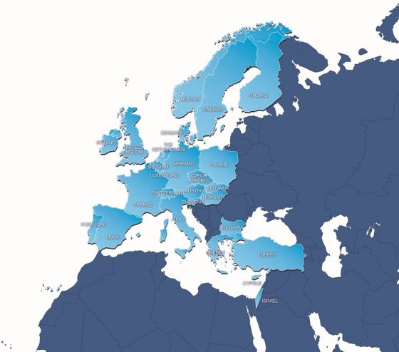

## BioExcel

BioExcel is a European Centre of Excellence for computational biomolecular
research. Established in 2015, the centre has grown into a major research and
innovation hub for scientific computing. BioExcel develops some of the most
popular applications for modelling and simulations of biomolecular systems. A
broad range of additional pre-/post-processing tools are integrated with the
core applications within user-friendly workflows and container solutions. The
software stack comes with great performance and scalability capabilities for
extreme-scale utilization of the worlds largest high-performance computing
(HPC) and high-throughput computing (HTC) compute resource. BioExcel has
developed an extensive training program to address competence gaps in
extreme-scale scientific computing for beginners, advanced users and HPC/HTC
system maintainers. The centre maintains an extensive and growing network of
industrial researchers in the pharmaceutical, chemical and food industries,
and offers tailored products and consultancy services, while code development
is done in close collaborations with hardware and software vendors to ensure
compatibility and support for cutting-edge features. BioExcel works closely
with various governmental, non-profit, educational and policy projects and
initiatives.

## PRACE

[PRACE](https://prace-ri.eu/) (Partnership for Advanced Computing in Europe)
aims to enable high-impact scientific discovery and engineering research and
development across disciplines to enhance European competitiveness for the
benefit of society. PRACE seeks to achieve this by offering world-class
computing and data management resources and services. PRACE currently has
members from 26 countries across Europe.

Along with providing access to HPC infractructures across Europe, PRACE provides
world-class HPC training for researchers in Europe through its six PRACE Advanced
Training Centres (PATCs). Information about PRACE training can be found
[here](https://prace-ri.eu/).

## EPCC

EPCC is a self-funding institute at the University of Edinburgh that:
* provides world-class computing facilities for scientists
* collaborates with researchers in a wide range of areas
* provides companies with access to our computing expertise and specialist
computing facilities
* offers a wide range of training for computational scientists

EPCC has been running national parallel systems since 1994, and is currently
running the UK's national supercomputing service, ARCHER2.

## Who you are?



