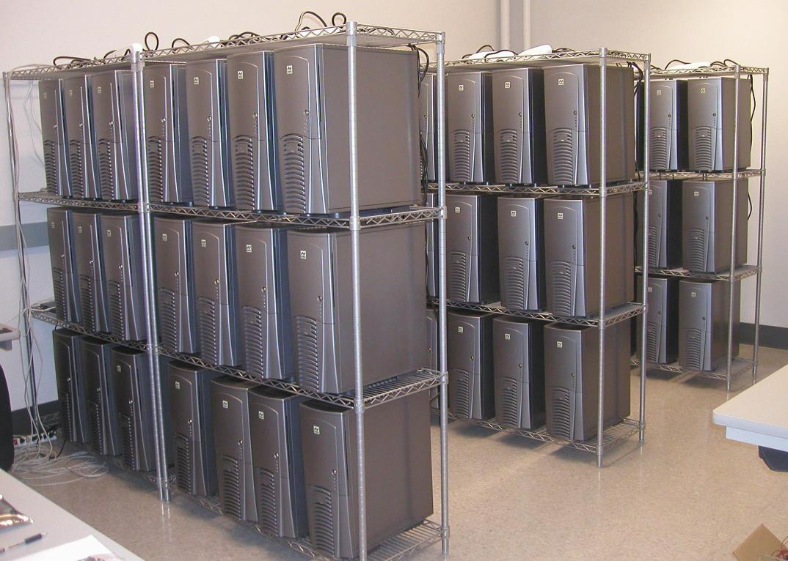
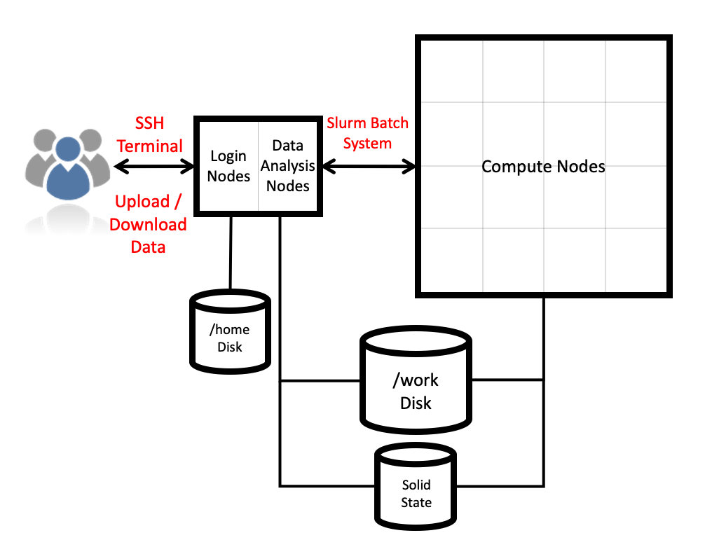

## Defining high-performance computing

The simplest way of defining hugh-performance computing is by saying that it
is the using of high-performance computers. However, this leads to our next
question.

> ### What is high-performance computer?
>
> On the Course Etherpad, write down what you think defines a high-performance
> computer.
> > A high-performance computer is a network of computers in a cluster that
> > typically share a common purpose and are used to accomplish tasks that
> > might otherwise be too big for any one computer.
{: .question}

## Generic parallel machines and computer clusters

Consider the computer you are using to see this -- it will have:

* a (probably multi-core) processor
* a hard drive
* memory
* an operating system (hopefully)
* ...

While modern computers can do a lot (and a lot more than their equivalents
10-20 years ago), there are limits to what they can do and the speed at which
they are able to do this. One way to overcome these limits is to pool computers
together to create a cluster of computers.

These pooled resources can then be used to run software that requires more total
memory, or need more processors to complete in a reasonable time.

## HPC architectures

Most HPC systems follow the idea described above. For example, ARCHER2 is
(currently) comprised of 1024 nodes, each of which has its multi-core
processors, its memory, *etc.* These nodes are connected together by a network.

### ARCHER2 architecture

## Uses of HPC



